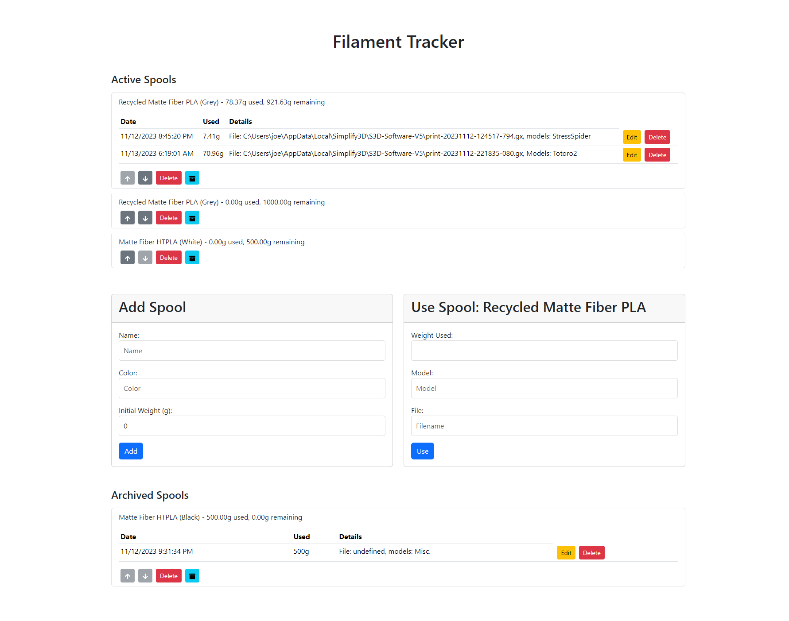
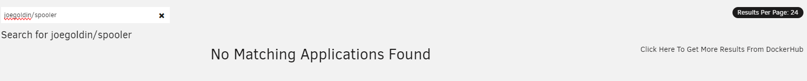
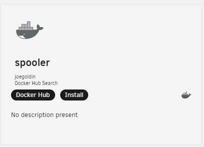
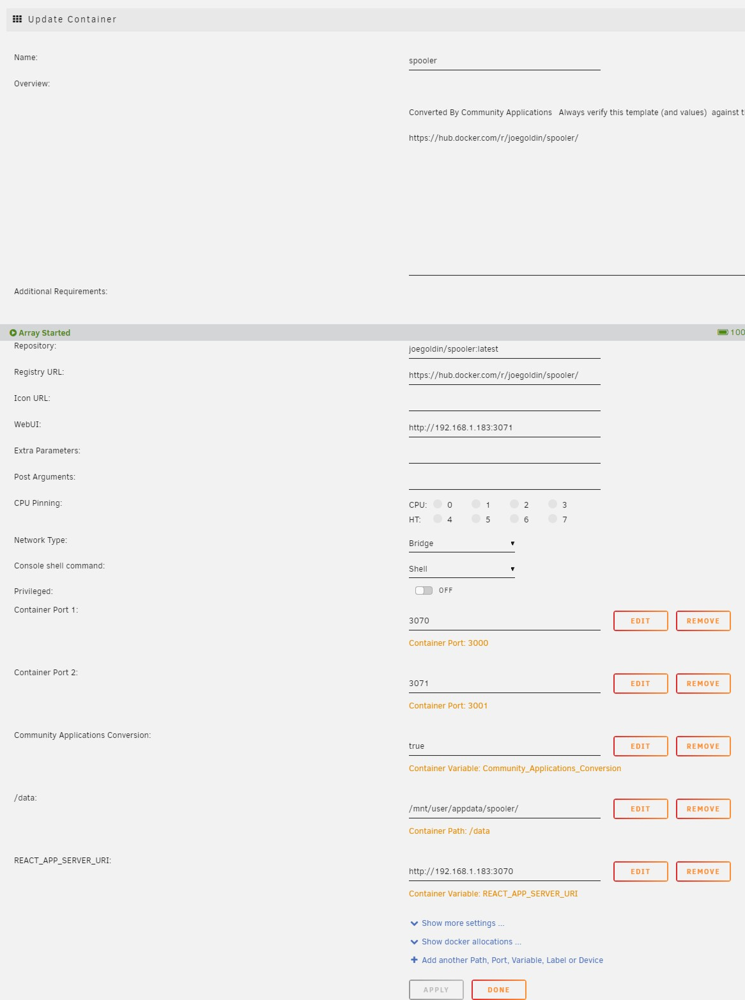

<center></center>

# Spooler
[](https://hub.docker.com/r/joegoldin/spooler) [](https://hub.docker.com/r/joegoldin/spooler)

Spooler is a web application for logging 3D printing usage. It exposes an API for integration with slicer software for automatic tracking.

Heavily inspired by [Spoolman](https://github.com/Donkie/Spoolman), but with a log of each spool's usage, rather than just total usage to date.

###### Warning: This project was built using heavy use of generative LLMs, use at your own risk. 🤙



## Quick Start

To run Spooler using Docker:

```bash
docker pull joegoldin/spooler:latest
docker run -p 3000:3000 -p 3001:3001 -v /path/on/host:/data joegoldin/spooler
```

To run for local development:
    
```bash
cd frontend/spooler && npm install && npm run local # in one terminal
cd backend && npm install && npm start # in another terminal
```

## Automatic Filament Tracking

### Simplify3D
See [slicers/README.md](slicers/README.md) for instructions on how to set up Simplify3D to automatically track filament usage.

## Unraid
You can install the docker container via Community Apps by searching for `joegoldin/spooler` and selecting `Click Here To Get More Results From DockerHub
No Matching Applications Found`.




If running in Unraid, make sure to set the `REACT_APP_API_URL` environment variable to the IP address of the host machine, so that the frontend can connect to the backend.

See this example Unraid configuration: 

