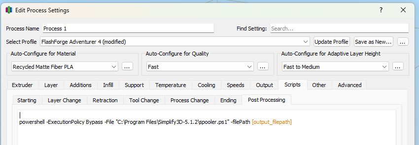

# Post Process Scripts for Slicers

## Simplify3D

You can use the following script to automatically track filament usage in Spooler when using Simplify3D. Just add the following line to the "Post processing" section of the "Scripts" tab in the "Edit Process Settings" dialog, and make sure the script file exists at the path you specify.

```bash
powershell -ExecutionPolicy Bypass -File "<PATH_TO_DOWNLOADED_FILE>/simplify3d.ps1" -filePath [output_filepath]
```


